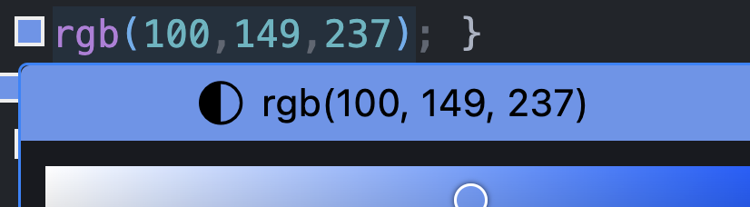
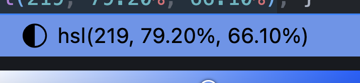

# Temas Básicos de CSS

## 1. Introducción a CSS
- **¿Qué es CSS?**

  **CSS** (Cascading Style Sheets) es un lenguaje de hojas de estilo que define la apariencia y el formato de un documento web. 
  Es decir, HTML le da estructura a la página web, mientras que CSS le da estilo.

- **Sintaxis básica**

  ```less
  selector {
    propiedad_1: valor_1;
    propiedad_2: valor_2;
    ...
  }
  ```

  - `selector`: Elemento HTML o clase o id, etc. que se va a estilizar
  - `propiedad`: Atributo que se va a modificar
  - `valor`: Valor que se le asigna a la propiedad
  
- **Formas de incluir CSS en HTML**

  - **Estilos en línea** (en la misma etiqueta HTML usando atributo `style`):

  ```html
  <p style="color:red">Texto en rojo.</p>
  ```
  
  - Etiqueta `<style>`:

  ```html
  <style>
    p {
        color: red;
    }
  </style>
  ```

  - **Archivos externos** (`style.css`, `main.css`, etc.):

  ```html
  <link rel="stylesheet" href="style.css">
  ```

- Comentarios en CSS:

```css

/* Comentario de una línea */

/* Comentario 
*  de 
*  varias 
* líneas
*/
```

## 2. Selectores

> **Idea clave**: un selector es simplemente una expresión que le dice al navegador “ve al árbol del DOM y encuentra estos nodos”. Todo lo demás (propiedades, cascada, herencia) ocurre **después** de que un selector ha elegido sus objetivos.

---

### 2.1 Selectores de tipo (etiquetas)
| | |
|---|---|
|**Definición**|Coinciden con todos los elementos de una etiqueta HTML concreta.|
|**Sintaxis**|`etiqueta { … }`|
|**Ejemplo**|`p, h1 { line-height: 1.6; }`|
|**Nota práctica**|Son los menos específicos (0-0-1 en la jerarquía de especificidad). Úsalos para estilos base o resets. Piensa en ellos como “valores por defecto” similares a configurar variables globales en tu backend.|

```html
<style>
  p, h1 { 
    line-height: 1.6; 
  }
</style>
<h1>Título principal</h1>
<p>Texto en párrafo</p>
```

---

### 2.2 Selectores de clase
| | |
|---|---|
|**Definición**|Seleccionan cualquier elemento que incluya un atributo `class` con el valor indicado.|
|**Sintaxis**|`.nombreDeClase { … }`|
|**Ejemplo**|`.card { box-shadow: 0 2px 8px #0003; }`|
|**Nota práctica**|Muy versátiles (0-1-0). Puedes reutilizar la clase en múltiples nodos—algo equivalente a inyectar un mismo middleware en varias rutas.|

```html
<style>
  .card { 
    box-shadow: 0 2px 8px #0003; 
    /* otros estilos */
    }
</style>
<div class="card">Card 1</div>
<div class="card">Card 2</div>
<div class="card">Card 3</div>
```

---

### 2.3 Selectores de ID
| | |
|---|---|
|**Definición**|Apuntan a un único elemento con un atributo `id` concreto. Los ids **deben ser únicos** por documento `.html`.|
|**Sintaxis**|`#idUnico { … }`|
|**Ejemplo**|`#header { position: sticky; top: 0; }`|
|**Nota práctica**|Los IDs son **muy** específicos (1-0-0). Evita basar tu sistema de diseño en ellos o terminarás usando `!important` para sobreescribirlos — el equivalente CSS de un hot-fix en producción.|

```html
<style>
  #header { 
    position: sticky; 
    top: 0;
    }
</style>
<div id="header">
  <!-- contenido del header -->
</div>
```

---

### 2.4 Selectores de atributo
| | |
|---|---|
|**Definición**|Permiten filtrar por la presencia o el valor de cualquier atributo.|
|**Sintaxis**|`[atributo]`, `[atributo="valor"]`, `[atributo^="comienzo"]`, `[atributo$="fin"]`, `[atributo*="contiene"]`|
|**Ejemplo**|`input[type="password"] { letter-spacing: 0.1em; }`|
|**Nota práctica**|Útiles para estilos contextuales sin añadir clases extras (p.e. formularios). Es como consultar una base de datos con un `WHERE` más específico.|

```html
<style>
  input[type="email"] { 
    /* estilos */
    }
</style>
<form>
  <input type=text>
  <input type=email>
  <!-- más inputs -->
</form>
```

---

### 2.5 Selectores descendentes
| | |
|---|---|
|**Definición**|Coinciden con cualquier elemento que esté **en cualquier nivel** por debajo del selector raíz.|
|**Sintaxis**|`A B { … }` (espacio simple)|
|**Ejemplo**|`nav a { text-decoration: none; }`|
|**Nota práctica**|Evita encadenar muchos niveles: `article section ul li a` es tan frágil como anidar demasiadas llamadas a funciones.|

```html
<style>
  nav a { 
    /* estilos */
    }
  nav.selected {
    /* estilos para class selected */
  }
  .selected {
    /* este selecciona a TODOS los class selected */
  }
</style>
<nav>
  <a href="#" class="selected">Home</a>
  <a href="#">Enlace 2</a>
  <a href="#">Enlace 3</a>
  <!-- más enlaces -->
</nav>
<!-- No es seleccionado por nav.selected: -->
<a class="selected">Enlace externo a nav</a>
```

---

### 2.6 Selectores de hijos directos
| | |
|---|---|
|**Definición**|Solo seleccionan **hijos directos** del primer selector.|
|**Sintaxis**|`A > B { … }`|
|**Ejemplo**|`ul > li { margin-block: .25rem; }`|
|**Nota práctica**|Piensa en la flecha `>` como el `JOIN` directo entre tablas; no recorre profundidad completa.|

```html
<style>
  /* Selector parent - child: a es hijo directo del nav */
  nav > a { 
    /* estilos */
    }
   /* 
    <nav>
      <a>...</a> 
     </nav> 
    */
</style>
<nav>
  <a href="#">Home</a>
  <a href="#">Enlace 2</a>
  <a href="#">Enlace 3</a>
  <!-- más enlaces -->
</nav>
<!-- Este enlace no es child del nav, no se selecciona con nav > a -->
<a>Enlace externo a nav</a>
```
---

### 2.7 Selectores hermanos
| | |
|---|---|
|**Definición**|Trabajan entre elementos que comparten el mismo padre. <br>• **Adjacente**: `A + B` (solo el siguiente inmediato) <br>• **General**: `A ~ B` (cualquier hermano posterior).|
|**Ejemplo**|`label + input { margin-left: .5rem; } code ~ code { margin-top: 1rem; }`|
|**Nota práctica**|Útiles para efectos dinámicos (p.e. abrir un acordeón). Son como acceder al “siguiente registro” en un cursor.|

```html
<style>
  /* Selecto de elementos adyacentes (seguidos sin otros elementos en medio): */
  label + input { 
    /* estilos */
    }
   /* 
    <label>...</label> 
    <input>
    */

  /* Selectores de elementos hermanos a cualquier nivel */
  label ~ span {
    /* estilos */
  }
</style>
<form>
  <label>Introduce tu email:</label>
  <input type=email placeholder="pepe@gmail.com">
  <span>Texto de ayuda</span>
  <span>Más texto de ayuda</span>
</form>
```

---

### 2.8 Pseudo-clases
| | |
|---|---|
|**Definición**|Refieren a **estados** dinámicos o posiciones lógicas de un elemento.|
|**Sintaxis**|`selector:pseudo { … }` (una sola `:`)|
|**Ejemplos**|`a:hover { color: var(--brand); } input:focus-visible { outline: 2px solid ; } li:nth-child(odd) { background: #f6f7f8; }`|
|**Nota práctica**|Piensa en ellas como banderas booleanas o “properties” cambiantes al estilo `isActive` en tu modelo.|

```html
  <style>
    /* hover := acción de colocar el cursor encima de un elemento de la web */
    a:hover {
      cursor: pointer;
      color: black;
    }
  </style>
  <a href="#">Enlace</a>
```

---

### 2.9 Pseudo-elementos
| | |
|---|---|
|**Definición**|Permiten estilizar **partes virtuales** de un elemento que no existen como nodos reales en el DOM.|
|**Sintaxis**|`selector::pseudo-element { … }` (doble `::` recomendado desde CSS3)|
|**Ejemplos**|`a::after { content: " ↗"; font-size: 0.8em; } p::first-line { font-weight: 600; }`|
|**Nota práctica**|Se comportan como “sub-componentes” renderizados sobre la marcha—no los confundas con pseudo-clases: unos crean partes, los otros describen estados.|

```html
  <style>
    /* ::after := pseudo-elemento que aparece después del contenido de un elemento */
    #myLink::after {
      content: " 👈🏼"; 
      font-size: 1.2em;
    }
    #myLink::before {
      content: "👉🏼 "; 
      font-size: 1.2em;
    }
  </style>
  <!-- ❌ Desventaja: modificamos el texto del enlace -->
  <a href="#">👉🏼 Enlace 👈🏼</a>
  <br>
  <!-- ✅ Ventaja: no modificamos el texto del enlace y podemos añadir estilos personalizados a cada pseudo-elemento -->
  <a id="myLink" href="#">Enlace</a>
```

Otro ejemplo:

```html
<style>
  p::first-letter {
    font-size: 3em;
    color: brown;
    margin-right: 0.05em;
  }
</style>

<p>Esto es un texto de HTML.</p>
```

---

### 2.10 Resumen visual de especificidad


> Inline styles > ID (1-0-0) > Clase/sAtributo/Pseudo-clase (0-1-0) > 
Tipo/Pseudo-elemento (0-0-1) > Universal *


> *Cuanto mayor la cifra a la izquierda, más difícil será sobreescribir el estilo sin escalar la guerra de `!important`s.* Por lo general, vamos a intendar no usar important siempre que sea posible para evitar este "problema" con especificidad.

```html
<style>
  #myId {
    color: brown!important;
  }
</style>

<p id="myId" style="color: red;">Texto en rojo?</p>
```

> En este caso el estilo inline no sería necesario y podríamos/deberíamos quitarlo. Muchas veces, se usa o abusa de `!important` en CSS para aplicar un estilo y suele propiciar malas prácticas.

> **tl;dr:** Un gran poder conlleva una gran responsabilidad => usar con cuidado.

- [Ejercicios de selectores](./ejercicios/selectores.md)

## 3. Modelo de Caja (Box Model)

> Todo elemento de bloque en el navegador se representa como una **caja** con 6 parámetros clave. Dominar estos valores es lo más cercano a ajustar “padding” y “margin” en tus responses JSON: un pequeño número cambia todo el layout.

---

### 3.1 `width` y `height`
| | |
|---|---|
|**Definición**|Tamaño **del contenido** de la caja (no incluye padding, border ni margin).|
|**Sintaxis**| `width: <longitud  %  auto>, height: <longitud  %  auto>`|
|**Ejemplo**|`.box { width: 300px; height: 180px; }`|
|**Notas dev**|`auto` deja que el navegador calcule según el contexto. `%` usa el contenedor padre como referencia. En realidad casi nunca defines ambos: fija uno y deja que el otro fluya, igual que al paginar resultados.|

```html
  <style>
    div > div {
      background-color: lightgray;
      border: 1px solid black;
      text-align: center;
    }
    .box1 {
      width: 300px;
    }
    .box2 {
      width: auto;
    }
    .box3 {
      width: 50%;
    }
  </style>
  <div>
    <div class="box1">Box 1 (300 px)</div>
    <div class="box2">Box 2 (auto)</div>
    <div class="box3">Box 3 (50% del parent)</div>
  </div>
```

- **Ejercicio:** Haz un ejemplo similar con `height`.

---

### 3.2 `padding`
| | |
|---|---|
|**Definición**|Espacio **interno** entre el contenido y el borde.|
|**Sintaxis**|`padding: top right bottom left;` (shorthand) <br>`padding-block`, `padding-inline` para lógica RTL.|
|**Ejemplo**|`.card { padding: 1rem 1.5rem; }`|
|**Notas dev**|Suma al tamaño final salvo que uses `box-sizing: border-box`. Piensa en `padding` como la serialización “pretty-print” que añade espacios legibles.|

```html
  <style>
    div > div {
      background-color: lightgray;
      border: 1px solid black;
      text-align: center;
      margin-bottom: 10px;
    }
    .box1 {
      width: 300px;
      padding: 10px;
      box-sizing: border-box;
    }
    .box2 {
      width: auto;
      padding: 1em;
    }
    .box3 {
      width: 50%;
      padding: 0;
    }
  </style>
  <div>
    <div class="box1">Box 1 (300 px)</div>
    <div class="box2">Box 2 (auto)</div>
    <div class="box3">Box 3 (50% del parent)</div>
  </div>
```

> El `padding` nos coloca espaciado interno en una caja entonces hace que el contenido no este pegado a sus márgenes y se pueda leer mejor.

---

### 3.3 `border`
| | |
|---|---|
|**Definición**|Línea que rodea padding y contenido.|
|**Sintaxis**|`border: <anchura> <estilo> <color>;` <br>Sub-propiedades: `border-top`, `border-radius`, etc.|
|**Ejemplo**|`img { border: 2px solid #ccc; border-radius: 50%; }`|
|**Notas dev**|Afecta al flujo del documento (ocupa espacio). Usa `outline` si solo necesitas remarcar sin mover nada.|

```css
  div {
      background-color: lightgray;
      border: 1px solid black;
      text-align: center;
      margin-bottom: 10px;
    }
```

---

### 3.4 `margin`
| | |
|---|---|
|**Definición**|Espacio **externo** entre la caja y elementos vecinos.|
|**Sintaxis**|`margin: top right bottom left;`|
|**Ejemplo**|`section { margin-block: 2rem; }`|
|**Notas dev**|Los márgenes verticales se “colapsan” entre elementos consecutivos (el mayor gana). Es como coalescer filas duplicadas en una consulta.|

```css
  div {
      background-color: lightgray;
      border: 2px solid black;
      text-align: center;
      margin-bottom: 25px;
    }
```

---

### 3.5 `box-sizing`
| | |
|---|---|
|**Definición**|Define qué incluye el navegador dentro de `width` y `height`.|
|**Valores**|`content-box` (por defecto) → tamaño = solo contenido. <br>`border-box` → tamaño = contenido + padding + border.|
|**Ejemplo**|`* { box-sizing: border-box; }`|
|**Notas dev**|`border-box` evita cálculos mentales al diseñar layouts (tamaño total constante). Es el equivalente a normalizar unidades antes de hacer sumas.|

```css
 .box1 {
      width: 300px;
      padding: 10px;
      box-sizing: border-box;
    }
```

---

### 3.6 `outline`
| | |
|---|---|
|**Definición**|Borde **no** incluido en el flujo: se pinta “por encima”, no afecta medidas ni colapsa márgenes.|
|**Sintaxis**|`outline: <anchura> <estilo> <color>;` <br>`outline-offset: <longitud>;`|
|**Ejemplo**|`button:focus-visible { outline: 3px dashed var(--brand); }`|
|**Notas dev**|Ideal para *focus rings* accesibles. No lo uses como sustituto de `border` si necesitas que el layout respete el espacio.|

```css
   .box3 {
      width: 50%;
      padding: 0;
      border:5px solid green;
      outline: 5px solid red;
    }
```

- Ejercicios de box model en [box-model.md](./ejercicios/box-model.md)

## 4. Colores y Fondos

En este tema aprendemos a usar colores y fondos en CSS.

## 4. Colores y Fondos en CSS

En este tema aprendemos a usar colores y fondos (backgrounds) en CSS.

### 1. Formatos de color

| Formato              | Sintaxis                  | Ejemplo                                                            | Ventajas                                                          |
| -------------------- | ------------------------- | ------------------------------------------------------------------ | ----------------------------------------------------------------- |
| **Nombres de color** | `color: red;`             | 147 nombres estándar (`red`, `cornflowerblue`, `goldenrod`, etc.). | Rápidos de escribir, buena legibilidad.                           |
| **RGB**              | `rgb(255, 0, 0)`          | `color: rgb(255, 0, 0);`                                           | Preciso; idéntico a valores de Photoshop / Figma.                 |
| **RGBA**             | `rgba(255, 0, 0, 0.5)`    | `background: rgba(0,0,0,0.25);`                                    | Igual que RGB + **canal alfa** (`0 = transparente`, `1 = opaco`). |
| **HEX**              | `#ff0000` (3 o 6 dígitos) | `#f00` ≡ `#ff0000`                                                 | Popular, compacto, compatible con todos los navegadores.          |
| **HSL**              | `hsl(0, 100%, 50%)`       | `hsl(200,70%,50%)`                                                 | Más intuitivo para girar tonos o ajustar claridad.                |
| **HSLA**             | `hsla(0, 100%, 50%, 0.5)` | `hsla(200,70%,50%,.2)`                                             | Como HSL con transparencia.                                       |

```css
/* Ejemplo comparativo */
.box-names { color: cornflowerblue; }
.box-rgb   { color: rgb(100, 149, 237); }
.box-hex   { color: #6495ed; }
.box-hsl   { color: hsl(219,79%,66%); }   /* mismo tono */
```

[!TIP]
> En VS Code podemos cambiar de una representación de color a otra haciendo click en el menú desplegable de los colores:



Click en rgb... para cambiar de formato.



Si sigues haciendo click vuelve a aparecer el formato RGB.

---

### 2. background-color

Establece un color de fondo sólido.

```css
.card {
  background-color: #fafafa;        /* gris muy claro */
}
```

> **Pro Tip:** valores semitransparentes (RGBA/HSLA) permiten overlays sin poner otra capa HTML.

### 3. background-image

Admite **una o varias** imágenes, rutas locales o URLs remotas, y gradientes.

```css
.hero {
  background-image: url("/img/cover.jpg"),
                    linear-gradient(180deg, rgba(0,0,0,0) 40%, rgba(0,0,0,0.6));
}
```

La lista se pinta **de izquierda a derecha** (la primera es la capa más cercana al usuario).

### 4. background-position

Define el punto de anclaje de cada capa.

| Valor                    | Resultado                                           |
| ------------------------ | --------------------------------------------------- |
| `left top` (por defecto) | Esquina superior-izquierda                          |
| `center center`          | Centrado completo                                   |
| `50% 50%`                | Igual que *center center*                           |
| `right 30%`              | 30 % desde la parte superior, alineado a la derecha |

```css
.banner {
  background-position: center 20%;   /* útil para visibilidad de rostros */
}
```

### 5. background-size

Controla el escalado:

* `cover` → rellena el contenedor, puede recortar.
* `contain` → muestra todo el contenido, puede dejar huecos.
* `auto`, valores `px`, `%` o pares `width height`.

```css
.avatar {
  background-size: cover;
}
```

### 6. background-repeat

| Valor                   | Uso               |
| ----------------------- | ----------------- |
| `repeat` (default)      | Repite en x e y   |
| `repeat-x` / `repeat-y` | Solo eje indicado |
| `no-repeat`             | Sin repetición    |

```css
.watermark {
  background-repeat: no-repeat;
}
```

### 7. background-attachment

* `scroll` → la imagen se desplaza con la página (por defecto).
* `fixed` → “parallax” simple: el fondo queda fijo respecto a la ventana.
* `local` → se mueve dentro de un elemento con *overflow*.

```css
.parallax-hero {
  background-attachment: fixed;
}
```

### 8. Degradados

Los *gradients* son **funciones de imagen** – se colocan en `background-image`.

#### 8.1 linear-gradient

```css
/* 45° de azul a morado */
.box {
  background-image: linear-gradient(45deg, #3b82f6, #9333ea);
}
```

* Primer argumento: **ángulo** (`deg`) o palabras clave (`to right`, `to bottom left`).
* Después, **colores** (tantos como quieras).
* Puedes indicar “stops”: `linear-gradient(90deg, red 0%, orange 50%, yellow 100%)`.

### 8.2 radial-gradient

```css
.badge {
  background-image: radial-gradient(circle at center,
                    hsl(50 100% 60%) 0%, hsl(50 100% 40%) 100%);
}
```

* Forma: `circle` (default) o `ellipse`.
* Posición: `at top right`, `at 30% 70%`, etc.

#### 8.3 Gradientes repetitivos

* `repeating-linear-gradient()`
* `repeating-radial-gradient()`

Útiles para patrones (rayas, cuadriculado).

```css
.tartan {
  background-image: repeating-linear-gradient(
    45deg,
    #555 0 10px,
    #333 10px 20px
  );
}
```

### 9. Ejemplo completo

```html
<section class="showcase">
  <h1>CSS Color & Background demo</h1>
</section>
```

```css
.showcase {
  /* Fondo compuesto */
  background-image:
    url("/img/forest.jpg"),
    linear-gradient(
      to bottom,
      rgba(0,0,0,0) 50%,
      rgba(0,0,0,0.6) 100%
    );
  background-size: cover;              /* cubre el hero */
  background-position: center top;     /* centra la foto */
  background-attachment: fixed;        /* parallax ligero */
  color: #fff;
  padding: 8rem 2rem;
  text-align: center;
}
```

### Checklist rápido del tema

* ✅ **Conocer** los 5 formatos de color y elegir el más cómodo.
* ✅ **Combinar** varias capas en `background-image` para efectos complejos.
* ✅ Ajustar posición, tamaño y repetición para evitar imágenes deformadas o mosaicos no deseados.
* ✅ Usar gradientes como “tinta” para overlays sin PNG ni extra divs.

---

Ya puedes empezar los [Labs 1 y 2](./labs.md)

## 5. Tipografía

Un sistema tipográfico coherente mejora la legibilidad, refuerza la identidad 
visual y, bien gestionado, facilita la accesibilidad.

En este tema, se describen las propiedades clave, con sintaxis, valores 
habituales, buenas prácticas y ejemplos mínimos.

---

### 5.1 `font-family` — familia tipográfica

| Qué hace                                                                                                                                                                                                              | Define la pila de fuentes que el navegador intentará cargar, de izquierda a derecha.                                       |
| --------------------------------------------------------------------------------------------------------------------------------------------------------------------------------------------------------------------- | -------------------------------------------------------------------------------------------------------------------------- |
| Sintaxis                                                                                                                                                                                                              | `font-family: "Open Sans", Roboto, Helvetica, Arial, sans-serif;`                                                          |
| Valores                                                                                                                                                                                                               | • nombres concretos (`"Fira Sans"`)<br>• genéricos (`serif`, `sans-serif`, `monospace`, `cursive`, `fantasy`, `system-ui`) |
| Buenas prácticas                                                                                                                                                                                                      |                                                                                                                            |
| • Ordenar las fuentes por preferencia y terminar con una familia genérica.<br>• Encerrar nombres con espacios en comillas.<br>• Incluir variantes locales para i18n, p. ej. `"Noto Sans SC"` para chino simplificado. |                                                                                                                            |

> [!TIP]
> **Custom fonts** – Carga con `@font-face` o servicios como Google Fonts; sirve los archivos con `font-display: swap` para evitar FOIT (flash of invisible text).

---

### 5.2 `font-size` — tamaño de letra

\| Sintaxis | `font-size: 1rem;` |
\| Unidades | • Absolutas: `px`, `pt`, `cm` (poco usadas en web).<br>• Relativas: `em`, `rem` (a la raíz), `%` (al contenedor), `vw/vh`, funciones `clamp()` y `calc()`. |
\| Recomendaciones |
\| • Usa `rem` para un punto de escala global (`html { font-size: 100%; }`).<br>• Para tipografía fluida: `font-size: clamp(1rem, 0.9rem + 1vw, 1.4rem);`. |

---

### 5.3 `font-weight` — grosor

\| Sintaxis | `font-weight: 700;` |
\| Valores  | Palabras clave `normal` (400) y `bold` (700) o números 100-900 en pasos de 100. |
\| Puntos clave |
\| • Verifica que tu archivo de fuente incluya los pesos declarados (evitar “faux bold”).<br>• Con *variable fonts* puedes animar o transicionar entre pesos (`font-variation-settings: "wght" 350;`). |

---

### 5.4 `font-style` — estilo

\| Sintaxis | `font-style: italic;` |
\| Valores | `normal`, `italic`, `oblique` (ángulo opcional → `oblique 10deg`). |
\| Nota | Italic usa un glifo propio; *oblique* inclina el glifo normal. Muchos navegadores sintetizan la cursiva si la fuente carece de ella. |

---

### 5.5 `line-height` — interlineado

\| Sintaxis | `line-height: 1.5;` *← valor recomendado* |
\| Unidades | • Relativa sin unidad (factor del tamaño de letra).<br>• Absoluta (`px`, `em`). |
\| Buenas prácticas | • Prefiere valores sin unidad: heredan de forma predecible y escalan mejor (`1.4 – 1.6`).<br>• Ajusta según la tipografía (x-height) y el contexto (lectura larga vs. UI). |

---

### 5.6 `text-align` — alineación horizontal

\| Sintaxis | `text-align: justify;` |
\| Valores  | `left`, `right`, `center`, `justify`, `start`, `end`, `match-parent`. |
\| Tips | • Usa `text-align: center` para cards, pero deja texto largo en `left/start` para legibilidad.<br>• `start` y `end` respetan la dirección del documento (`dir="rtl"`). |

---

### 5.7 `text-decoration` — adornos de texto

`text-decoration` es ahora un *shorthand* de:
`text-decoration-line`, `text-decoration-style`, `text-decoration-color`, `text-decoration-thickness`.

```css
a {
  text-decoration: underline;
}

.marked {
  text-decoration-line: underline overline;
  text-decoration-style: wavy;
  text-decoration-color: hotpink;
}
```

\| Valores línea | `underline`, `overline`, `line-through`, `none`, combinaciones |
\| Buenas prácticas | • Para enlaces, personaliza `text-decoration-color` en foco/hover en lugar de quitar el subrayado (accesibilidad). |

---

### 5.8 `text-transform` — cambio de capitalización

\| Sintaxis | `text-transform: uppercase;` |
\| Valores | `none`, `capitalize`, `uppercase`, `lowercase`, `full-width`, `full-size-kana`. |
\| Nota | Solo cambia la presentación; el DOM conserva el texto original (útil para búsquedas). |

---

### 5.9 `letter-spacing` — espaciado entre letras

\| Sintaxis | `letter-spacing: 0.05em;` |
\| Unidades | Relativas (`em`, `rem`) o absolutas (`px`). |
\| Consejos | • Ajusta kerning en títulos grandes o cuando uses versalitas.<br>• Puede aceptar valores negativos (`-0.02em`) para condensar. |

---

### 5.10 `word-spacing` — espacio entre palabras

\| Sintaxis | `word-spacing: 0.2em;` |
\| Uso | Menos común; se usa para textos justificados o diseños con tipografía display. |

---

### Ejemplo completo

```html
<section class="hero">
  <h1>La tipografía importa</h1>
  <p>Configurar bien fuente, tamaño, peso y espacio hace tu web más legible y accesible.</p>
</section>

<style>
:root {
  --font-main: "Inter", Helvetica, Arial, sans-serif;
}

.hero {
  font-family: var(--font-main);
  font-size: clamp(1rem, 0.9rem + 1vw, 1.3rem);
  line-height: 1.6;
  text-align: center;
  margin: 2rem auto;
  max-width: 60ch;
}

.hero h1 {
  font-weight: 700;
  letter-spacing: -0.015em;
  text-transform: uppercase;
  margin-bottom: 0.5em;
}

.hero p {
  font-weight: 400;
  text-decoration: underline hotpink;
}
</style>
```

---

### Accesibilidad y buenas prácticas generales

1. **Escalabilidad:** Usa unidades relativas (`rem`, `em`, sin unidad) para respetar el zoom del navegador.
2. **Contraste:** El subrayado o cualquier decoración debe mantener un contraste mínimo (WCAG 2.2 §1.4.3).
3. **Responsive type:** Combina `clamp()` o media queries para tipografía fluida.
4. **Espaciado de texto (WCAG 1.4.12):** Garantiza que tu UI soporte aumentos de `letter-spacing` 0.12 em, `word-spacing` 0.16 em y `line-height` 1.5 sin romperse.
5. **Rendimiento:** Sirve las fuentes en `woff2`, activa `font-display: swap` y agrupa las peticiones en un solo `@font-face` cuando uses variable fonts.

## 6. Modelo de Visualización
- display (block, inline, inline-block, flex, grid, none)
- visibility
- overflow
- position (static, relative, absolute, fixed, sticky)
- z-index
- float y clear

## 7. Flexbox
- Conceptos básicos
- Flex container
  - flex-direction
  - flex-wrap
  - justify-content
  - align-items
  - align-content
- Flex items
  - order
  - flex-grow
  - flex-shrink
  - flex-basis
  - align-self

## 8. Grid
- Conceptos básicos
- Grid container
  - grid-template-columns
  - grid-template-rows
  - grid-template-areas
  - gap
  - justify-items
  - align-items
  - place-items
- Grid items
  - grid-column
  - grid-row
  - grid-area
  - justify-self
  - align-self
  - place-self

## 9. Transiciones y Animaciones
- transition
- @keyframes
- animation
- transform
- transform-origin
- perspective
- backface-visibility

## 10. Diseño Responsivo
- Viewport
- Media Queries
- Unidades relativas (%, vw, vh, rem, em)
- Imágenes responsivas
- Mobile-first vs Desktop-first

## 11. Variables CSS
- Definición de variables (--nombre)
- Uso de variables (var())
- Ámbito de las variables

## 12. Preprocesadores CSS (Breve introducción)
- SASS/SCSS
- LESS
- Stylus
- Variables
- Anidamiento
- Mixins
- Herencia

## 13. Metodologías CSS
- BEM (Block, Element, Modifier)
- OOCSS (Object-Oriented CSS)
- SMACSS (Scalable and Modular Architecture for CSS)
- ITCSS (Inverted Triangle CSS)

## 14. Herramientas y Recursos
- DevTools del navegador
- Validadores de CSS
- Prefijos de proveedores
- Normalize.css y Reset CSS
- Frameworks CSS populares (Bootstrap, Tailwind, etc.)

## 15. Buenas Prácticas
- Especificidad
- Herencia
- Organización del código
- Nomenclatura
- Rendimiento
- Accesibilidad

## 16. Novedades en CSS
- CSS Grid Layout
- Flexbox
- Custom Properties (Variables CSS)
- CSS Grid Subgrid
- Container Queries
- Cascade Layers
- :has() selector
- Aspect Ratio
- Scroll Snap

---

## Referencias

- W3Schools: https://www.w3schools.com/css/
- MDN Web Docs: https://developer.mozilla.org/es/docs/Web/CSS