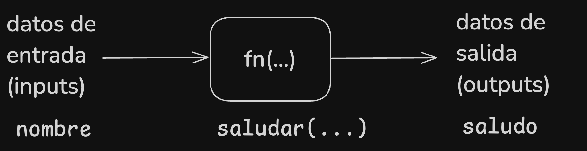
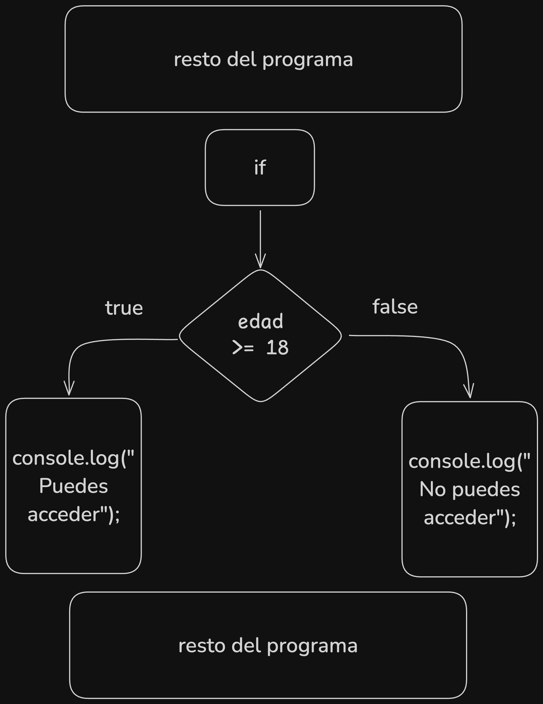
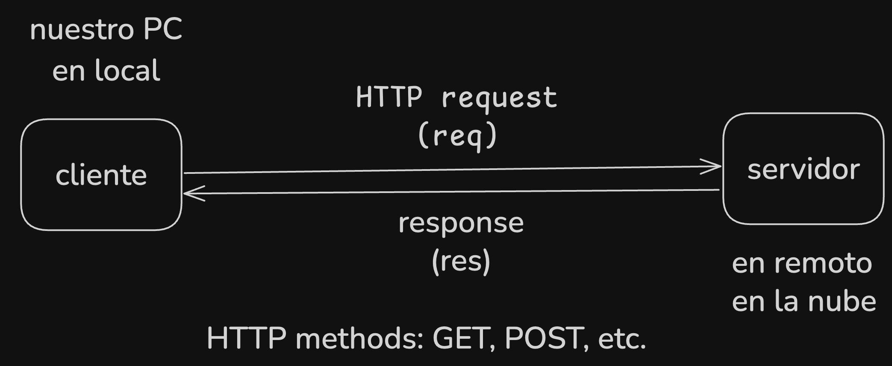

# Temario JavaScript para Web / Front-End

## Parte I — Introducción a JavaScript y Fundamentos ES6

### 1. Introducción a JavaScript

JavaScript es un lenguaje de programación **interpretado**, de **tipado dinámico** 
y multiparadigma (imperativo, funcional y orientado a objetos). Nació en 1995 
para dar interactividad al navegador y hoy se usa tanto en **front-end** como en
 **back-end** (Node.js, Deno, Bun, ...), móviles, IoT, etc.

### 2. Variables: `let`, `const` y `var`

- ❌ **`var`**  
  - Funcionan con **hoisting**: su declaración se eleva al inicio de la función o del script.  
  - Ámbito de **función** (no de bloque).  
  - Puede redeclararse y reasignarse.
- ✅ **`let`**  
  - Bloquea la variable en el **scope de bloque** (`{ … }`).  
  - No permite redeclaración en el mismo scope.  
  - Sufre la **Temporal Dead Zone** hasta su inicialización.

  ```js
  let a = 1;
  a = 2; // a vale 2
  let a = 3; // Error => ya existe la variable a y no se puede volver a declara en el mismo bloque
  ```
- ✅ **`const`**  
  - Igual que `let`, pero **constante**: debe inicializarse al declararse y no puede reasignarse.  
  - Ojo: si referencia un objeto o array, sus propiedades o elementos **sí** pueden mutar.

  ```js
  const PI = 3.14;
  PI = 3.14159; // TypeError => ya existe el identificador (variable const) PI
  ```

```js
  // Copia este código en la Consola del navegador:
  console.log(a); // undefined  (hoisting de var)
  // console.log(b); // ReferenceError (TDZ)
  var a = 1;
  let b = 2;
  const c = 30;
  b = 20;
  // c = 31; // TypeError => no se puede reasignar a una constante
```

> [!TIP]
> ❌ No debe usarse `var` en ES6, usa `let` o `const` en su lugar.

### 3. Hoisting y `scope`

> [!NOTE]
> **Scope** := ámbito o alcance de una variable o función, es decir, donde se puede usar.
> **Hoisting** := declaraciones de `var` y funciones **se elevan** al inicio de su contexto (función o global).

- **Scope global**: variables declaradas fuera de cualquier función.

```js
 let miVariable = 1; // global
 // resto del código
```

- **Scope de función**: variables creadas con `var` o funciones dentro de una función.

```js
function miFuncion() {
  var miVariable = 1; // local
  // resto del código
}
```

- **Scope de bloque**: variables `let`/`const` dentro de `{ … }`.

```js
// bloque:
{
  var x = 1;
  let y = 2;
}
console.log(x); // 1
// console.log(y); // ReferenceError
```

En caso de que queramos usar una misma variable en el bloque general y en otro, lo más simple es declarar las variables al principio del programa: 

```js
  let variable; // undefined
  console.log(variable); // undefined
  {
  variable = 1
  }
  console.log(variable); // 1
```

### 4. Declaración vs Expresión de Funciones

> [!NOTE]
> En programación, una función es un bloque de código que se ejecuta cuando se llama a la misma.
> `function sumar(a, b) { return a + b; }` es una función que acepta dos parámetros y devuelve el resultado de la suma de los dos.
> `function saludar() { console.log('¡Hola!'); }` es una función que imprime el mensaje "¡Hola!" en la consola.

- **Declaración** (`function foo() { … }`): se hoistea completamente, puede llamarse antes de su aparición en el código.
- **Expresión** (`const foo = function() { … }`): se comporta como variable `const`/`let`, no hay hoisting de la asignación.

```js
// Sin hoisting (forma recomendada al principio 👈🏼):
function decl() { return 'hola'; }
// resto del programa
console.log(decl()); // “hola”
```

```js
// Con hoisting primero usamos la función y después la declaramos:
console.log(decl()); // “hola”
// resto del programa
function decl() { return 'hola'; }
```
```js
// ❌ no funciona:
console.log(expr()); // TypeError: expr is not a function
const expr = function() { return 'hola'; };
```

```js
// ✅ funciona:
const expr = function() { return 'hola'; };
// resto del programa
console.log(expr()); // En este caso no hay problema (sin hoisting)
```

### 5. Arrow Functions

Sintaxis compacta, **no** tienen su propio `this`, `arguments`, ni `new.target`.

```js
// Declaración clásica
const sq1 = function(n) { return n * n; };
// Evaluamos con n = 3:
sq1(3); // 9

// Arrow function
const sq2 = n => n * n;
// Evaluamos con n = 3:
sq2(3); // 9

// Podemos comprobar que ambas son funciones:
typeof sq1; // 'function'
typeof sq2; // 'function'
```

Otro ejemplo de función:

```js
// Múltiples parámetros y cuerpo de bloque
const sum = (a, b = 0) => {
  const res = a + b;
  return res;
};
```

#### Parámetros y Retorno de Funciones



- **Sin parámetros y sin retorno:** `function saludar() { console.log('¡Hola!'); }`
  - Sin parámetro -> no recibe datos o inputs `()` vacío
  - Sin retorno -> no devuelve nada `undefined` => `let saludo = saludar(); // undefined`
- **Sin parámetros y con retorno:** `function saludar() { return 'Hola'; }`
  - Sin parámetro -> no recibe datos o inputs `()` vacío
  - Con retorno -> devuelve un valor `let saludo = saludar(); // Hola` => podemos guardar el resultado en una variable para uso posterior en el programa
- **Con parámetros y sin retorno:** `function saludar(nombre) { console.log('¡Hola, ' + nombre + '!'); }`
  - Con parámetro -> recibe datos o inputs `let saludar = saludar('Pepe'); // ¡Hola, Pepe!`
  - Sin retorno -> no devuelve nada `let saludar = saludar('Pepe'); // undefined`
- **Con parámetros y con retorno:** `function saludar(nombre) { return '¡Hola, ' + nombre + '!'; }`
  - Con parámetro -> recibe datos o inputs, en este caso recibimos `nombre`
  - Con retorno -> devuelve un valor `let saludar = saludar('Pepe'); // ¡Hola, Pepe!`


### 6. Parámetros Default, Rest & Spread

- **Default**: valor si no se pasa argumento.
- **Rest** (`...args`): agrupa restos en un array.
- **Spread** (`...arr`): expande iterables en elementos individuales.

```js
function saludar(name = 'Invitado') {
  console.log(`¡Hola, ${name}!`);
}

saludar(); // ¡Hola, Invitado!
saludar('Pepe'); // ¡Hola, Pepe!
```

Ejemplo de uso de operador spread (`...`) con array de números:

```js
function total(...nums) {
  return nums.reduce((acc, n) => acc + n, 0);
}

const arr1 = [1, 2, 3];
const arr2 = [...arr1, 4, 5]; // [1,2,3,4,5]
```

### 7. Destructuring de Objetos y Arrays

Extrae valores en variables de forma clara.

```js
// Array
const colores = ['rojo', 'verde', 'azul'];
const [primero, segundo] = colores; // primero='rojo', segundo='verde'

// Objeto
const usuario = { nombre: 'Ana', edad: 25, pais: 'ES' };
const { nombre, pais: locale } = usuario; // nombre='Ana', locale='ES'

// Valores por defecto y anidado
const data = { id: 1, info: { email: null } };
const { info: { email = 'n/a' } } = data; // email='n/a'
```

### ⚡ Retos rápidos (10–15 min cada uno)

1. **Swap**: intercambia dos variables `a` y `b` usando destructuring. También podemos usar una tercera variable para intercambiar los datos.
2. **Media**: función `promediar(...nums)` que calcule la media de N números. La media es la suma de los números dividida entre el número de números.
3. **Saludo**: arrow function con parámetro default que devuelva `"¡Hola, Invitado!"`.
4. **Config**: dado el objeto `{ debug: true, verbose: false }`, usa destructuring para extraer `debug` y `verbose`. Se pueden guardar en dos variables que se llamen `debug` y `verbose`.
5. **Spread**: combina dos arrays de frutas en uno solo usando spread.

```js
// Ejemplo array1 = ['manzana','pera'], array2 = ['uvas','kiwi'] → resultado: ['manzana',…,'kiwi']
```

<details>
  <summary> 👉🏼 Soluciones</summary>
  <ul>
    <li>Ejercicio 1:
    Usando una tercera variable para intercambiar los datos.
    <pre>
      <code>
  let a = 1;
  let b = 2;
  let swap;
  console.log(a, b, swap)
  // > 1 1 2 undefined
  undefined
  swap = a;
  a = b;
  b = swap;
  console.log(a, b, swap)
  // > 2 1 1
      </code>
    </pre>
    Usando destructuring directamente:
    <pre>
      <code>
  let a = 1;
  let b = 2;
  [a, b] = [b, a];
  console.log(a, b)
  // > 2 1
      </code>
    </pre>
    Usando destructuring y un array:
    <pre>
      <code>
  const valores = [1, 2];
  let [a, b] = valores
  console.log(a, b)
  // > 1 2
  [b, a] = valores
  console.log(a, b)
  // > 2 1
      </code>
    </pre>
    </li>
    <li>Ejercicio 2:
    <pre>
      <code>
  function promediar(...nums) {
    return nums.reduce((acc, n) => acc + n, 0) / nums.length;
  }
  console.log(promediar(1, 2, 3, 4, 5))
  // > 3
      </code>
    </pre>
    </li>
    <li>Ejercicio 3:
    <pre>
      <code>
  // con function:
  function saludar1(nombre = 'Invitado') {
    return `¡Hola, ${nombre}!`;
  }
  // con arrow function:
  const saludar2 = (nombre = 'Invitado') => `¡Hola, ${nombre}!`;
  console.log(saludar1())
  // > ¡Hola, Invitado!
  console.log(saludar2())
  // > ¡Hola, Invitado!
      </code>
      </pre>
    </li>
    <li>Ejercicio 4:
      <pre>
        <code>
  const config = { debug: true, verbose: false };
  const { debug, verbose } = config;
  console.log(debug, verbose)
  // > true false
        </code>
      </pre>
    </li>
    <li>Ejercicio:
    <pre>
      <code>
  const array1 = ['manzana','pera'];
  const array2 = ['uvas','kiwi'] // → resultado: ['manzana',…,'kiwi']
  console.log(array1, array2)
  // > ['manzana', 'pera'] ['uvas', 'kiwi']
  const array3 = [...array1, ...array2];
  console.log(array3)
  // > ['manzana', 'pera', 'uvas', 'kiwi']
      </code>
    </pre>
    </li>
</details>

---

### Estructuras de datos primitivas de JavaScript

- **Number**  
  Valores numéricos: enteros, flotantes, `NaN`, `Infinity`. Operaciones con `+`, `-`, `*`, `/`, `%`, y métodos como `toFixed()`.  

> [!NOTE]
> Solo hay un tipo numérico en JS, por lo tanto `1` y `0.333333...` se almacenan con la misma memoria, **64 bits** (1 bit es un 0 o un 1):
> En JavaScript, todos los valores primitivos de tipo Number se representan internamente como IEEE 754 de doble precisión (64 bits), que se desglosan así:
>
> - 1 bit para el signo
> - 11 bits para el exponente
> - 52 bits para la mantisa (fracción)
>
> Eso significa que, en bruto, cada valor Number ocupa 8 bytes en memoria (64 bits).

```js
let num = 1;
num = 0.3333333333333333;
typeof num; // 'number'
```

- **String**  
  Secuencias de caracteres entre comillas simples, dobles o backticks (plantillas). Propiedades (`.length`) y métodos (`.slice()`, `.toUpperCase()`, `` `${}` ``).  

> [!NOTE]
> Podemos usar comillas simples, dobles o backticks para crear una cadena de texto.
> Cada caracter de un string ocupa 1 byte en memoria (8 bits).

```js
let str = 'Hola';
str = "Hola de nuevo";
str = `Hola de nuevo`; 
typeof str; // 'string'
```

- **Boolean**  
  Solo dos valores: `true` y `false`. Resultado de comparaciones y expresiones lógicas.  

> [!NOTE]
> Los valores booleanos se almacenan con la misma memoria que los números, por lo que `true` y `false` son equivalentes a `1` y `0`.
> En memoria, los booleanos se almacenan como 1 bit (0 o 1).

```js
let bool = true;
bool = false;
typeof bool; // 'boolean'
```

- **Null**  
  Literal que indica "ausencia intencional de valor".  
  
> [!WARNING]
> `typeof` devuelve `object` para `null` pero debería devolver `null`. Esto es un bug conocido en JS que no se puede arreglar.

¿Cuándo se usa `null`?

- Si esperamos un valor y no lo tenemos podemos indicar que no hay valor con `null`.
- Es diferente a `undefined` (no definido) que es el valor que se asigna por defecto a una variable en JS.

```js
let email; // undefined
// intentamos leer el valor del email
// si no conseguimos el valor del email (por el motivo que sea)
email = null; // 👉🏼 el valor no se conoce o no se ha podido leer
```

Otra alternativa usando el mismo tipo de dato que el email:

```js
let email = ''; // 👈🏼 el valor es el string vacío
// intentamos obtener el email o colocamos string vacío
```

- **Undefined**  
  Valor por defecto de una variable declarada sin inicializar, o de una propiedad inexistente.  

```js
let email;
typeof email; // 'undefined'
```

¿Cuándo se usa `undefined`?

- Si no esperamos un valor y no lo tenemos podemos indicar que no hay valor con `undefined`.
- Es el retorno por defecto de una función que no devuelve nada.
- Se podría usar en casos en los que se usa `null` pero puede ser confuso.

- **Symbol**  
  Un identificador único que no puede ser reasignado.

```js
const s = Symbol('s');
const s2 = Symbol('s');
s === s2; // false
```

¿Cuándo se usa `Symbol`?

- Cuando necesitemos un identificador único para un objeto.
- Cuando queramos ocultar campos de un objeto al representarlo en el DOM.

- **BigInt**  
  Números enteros de larga escala. No soportado en todos los navegadores.
  ```js
  const n = BigInt(10);
  ```

¿Cuándo se usa `BigInt`?

- Cuando necesitemos un número entero de larga escala. => superior al rango máximo de `number`.
- Cuando necesitemos precisión adicional en cálculos con muchos decimales o grandes números.

```js
9007199254740991 * 1e85
// 9.00719925474099e+100
// Mientras que en BigInt tenemos todos los dígitos:
BigInt(9007199254740991 * 1e85).toString()
// '90071992547409905776464733974940456658968001547918808826399641003255019463714484354073444654786805760'
```

- **Object**
  Un objeto es una colección dinámica de pares clave : valor.

```js
const persona = {
  nombre: 'Ana',
  edad: 30,
  saludar() {
    console.log(`Hola, soy ${this.nombre}`);
  }
};
```

¿Cuándo se usa `Object`?

- Cuando necesitemos modelar alguna estructura de datos del mundo real o abstracción para nuestro programa.
  - Por ejemplo, usuarios en una aplicación.
  - Objetos de datos de una API.
  - Datos de una base de datos, etc.

Otros:

- **Funciones**: son bloques de código "con nombre" que se ejecutan cuando se las llama.
```js
function suma(a, b) {
  return a + b;
  }
```
- **Clases**: son una forma de modelar objetos con propiedades y métodos.
```js
class Persona {
  constructor(nombre, edad) {
    this.nombre = nombre;
    this.edad = edad;
  }
  saludar() {
    console.log(`Hola, soy ${this.nombre}`);
  }
}
const ana = new Persona('Ana', 30);
ana.saludar();
```
- **Arrays**: son una colección de valores que se pueden acceder por índice.
```js
const numeros = [1, 2, 3, 4, 5];
```

---

### Bucles y condicionales en JavaScript

- **if / switch / ternario**  

#### Bucle if

Sirve para crear bloques con condiciones que se van a evaluar.
Solo se ejecuta el bloque si la condición es verdadera.

- `if` := si condicional
- `else`:= si no condicional // en caso contrario
- `else if` := además, si condicional

```js
if (condicion) {
  // ejecutar este bloque
}
```
Ejemplo:

**if**

```js
// pedimos la edad al usuario
if (edad >= 18) {
  console.log("Puedes acceder a la página");
}
// solo se ejecuta el console.log si edad es igual o mayor a 18
// en caso de false no se ejecuta el bloque
```

**if-else**

```js
// pedimos la edad al usuario
if (edad >= 18) {
  console.log("Puedes acceder a la página");
} else {
  console.log("No puedes acceder a la página");
}
// si edad es menor a 18 se ejecuta el primer console.log
// en caso de false se ejecuta el segundo console.log
```



**if-else if-else**

`if (cond) {…} else if (…) {…} else {…}`  

```js
// pedimos la edad al usuario
if (edad > 18) {
  console.log("Puedes acceder a la página");
} else if (edad == 18) {
  console.log("Tienes 18 años, enhorabuena!");
} else {
  // edad < 18
  // y cualquier otro caso
  console.log("No puedes acceder a la página");
}
```

#### Bucle switch

Es similar al if pero se evaluan los casos exactos que sean de interés para nuestro programa.

  - `switch(valor) { case ‘a’: …; break; … }`  

- `switch`:= conmutar, alternar (una variable en este caso)
- `break` := parar o frenar => salir del bucle donde se usa el break
- `default`:= es equivalente al `else` del bucle `if` => se evalua si no hay un caso (`case`) que se haya ejecutado antes => no necesita `break`

Ejemplo`

```js
// vamos a evaluar los días de la semana
// guardo el día de la semanana en diaSemana
switch (diaSemana.toLowerCase()) {
  case "lunes":
    console.log("Hoy es lunes");
    break;
  case "martes":
    console.log("Hoy es martes");
    break;
  case "miércoles":
    console.log("Hoy es miércoles");
    break;
  case "jueves":
    console.log("Hoy es jueves");
    break;
  case "viernes":
    console.log("Hoy es viernes");
    break;
  case "sábado":
    console.log("Hoy es sábado");
    break;
  case "domingo":
    console.log("Hoy es domingo");
    break;
  default:
    console.log("Hoy no es ningún día de la semana");
}
```

  - Operador ternario: `cond ? expr1 : expr2`  

Ejemplo:

```js
edad > 18 
  ? console.log("Es mayor de edad") 
  : console.log("No es mayor de edad")
```

#### Bucle for

Nos permite repetir instrucciones una cantidad conocida de veces.

- **for**  
  Bucle clásico con inicializador, condición y paso:  
  ```js
  for (let i = 0; i < n; i++) { … }
  ```

Ejemplo:
```js
// Sumar los número enteros del 1 al 100
let suma = 0;
for (let i = 1; i <= 100; i++) {
  suma += i;
}
console.log(suma); // 5050
```

```js
// Hacemos una cuenta atrás desde 10 a 0
for(let contador = 10; contador >= 0; contador = contador - 1) {
  console.log(contador)
}
```

* **while** y **do…while**

Sirve para repetir instrucciones siempre que una condición sea verdadera.

- `while` := mientras => ejecuta las instrucciones mientras la condición que se evalua sea `true`

  * `while (cond) {…}` repite mientras `cond` sea verdadera.
  * `do {…} while (cond)` ejecuta al menos una vez antes de comprobar `cond`.

```js
// Suma de 100 primeros números
let contador = 0;
let suma = 0;
while(contador <= 100){
  suma = suma + contador;
  contador = contador + 1;
}
console.log(suma) // 5050
```

```js
// Cuanta atrás desde 10 a 0
let contador = 10; // valor inicial
while(contador >= 0){
  console.log(contador);
  contador = contador - 1;
}
console.log(""); // para ocultar el último valor del contador que aparece en la consola
```

---

### Objetos en JavaScript

Un **objeto** es una colección dinámica de pares clave : valor.

```js
const persona = {
  nombre: 'Ana',
  edad: 30,
  saludar() {
    console.log(`Hola, soy ${this.nombre}`);
  }
};
```

* **Acceso**

  * Punto: `persona.nombre`
  * Corchetes: `persona['edad']`
* **Añadir / modificar**

  ```js
  persona.apellido = 'Pérez';
  persona.edad = 31;
  ```
* **Eliminar**

  ```js
  delete persona.apellido;
  ```
* **Métodos y `this`**
  Funciones internas que pueden usar `this` para referirse al propio objeto.

```js
persona.saludar(); // "Hola, soy Ana"
```

## ⚡ Retos rápidos (10–15 min cada uno)

1. **Tipo y Conversión**  

   - Declara una variable `let x = "123.45";` y comprueba con `typeof` su tipo.  
   - Convierte `x` a número usando `Number()` y muestra el resultado y su tipo.  

2. **Validación con Boolean y Ternario**  

   - Crea `const email = ""` (cadena vacía).  
   - Usa un ternario para asignar `status = email ? "válido" : "invalido"` y muestra `status`. Se puede usar `length` para comprobar si hay contenido en el string. 

3. **Bucle `for` y Array de Strings**  

   - Dado `const frutas = ['manzana','pera','uva'];`, recórrelo con un `for` y muestra cada fruta en consola prefijada por su índice (p. ej. `0: manzana`). Necesitamos un índice que empieza en `0` y termina en `2` (en este caso) o podemos usar de valor final `frutas.length`.

4. **`while` y Contador Descendente**  

   - Crea `let n = 5;` y, usando `while`, muestra en consola los números de 5 a 1. Al terminar, muestra `"¡Despegue!"`.  

5. **Objeto y Método con `this`**  

   - Define  
     ```js
     const coche = { 
       marca: 'Toyota', 
       arrancar() { console.log(`Arrancando ${this.marca}`); } 
     };
     ```  
   - Añade al objeto una propiedad `modelo` con valor `'Corolla'` y luego llama a `coche.arrancar()`.  

<details>
  <summary> 👉🏼 Soluciones</summary>
  <ul>
    <li><strong>Ejercicio 01<strong>
    <pre>
      <code>
  // Declaramos una variable string:
  let x = "123.45"
  console.log(x, typeof x);
  // Conversión a Number o casting:
  x = Number(x);
  console.log(x, typeof x);
      </code>
    </pre>
    </li>
    <li><strong>Ejercicio 02</strong>
    <pre>
      <code>
  // Declaramos una variable email como string vacío:
  const email = "";
  // Aplicamos un ternario para verificar si hay contenido:
  let status = email ? "válido" : "invalido";
  console.log("El status del email es:", status);
  // Asignamos un email a otra variable (const no permite reasignar):
  const email2 = "pepe@gmail.com";
  status = email2 ? "válido" : "invalido"; 
  console.log("El status del email2 es:", status);
  // Nota: no es una verificación exhaustiva, solo comprobamos si hay algún
  // caracter en el email :) 
      </code>
    </pre>
    </li>
    <li><strong>Ejercicio 03</strong>
    <pre>
      <code>
  // Definimos el array de frutas:
  const frutas = ['manzana','pera','uva'];
  // Hacemos un bucle for desde índice 0 a indice menor que la longitud del 
  // array (el número de elementos que tiene) => todos los arrays empiezan sus 
  // índices en 0 y terminan en array.length - 1
  for(let i = 0; i < frutas.length; i++ ){
    console.log(`${i}: ${frutas[i]}`)
  }
      </code>
    </pre>
    </li>
    <li><strong>Ejercicio 04</strong>
    <pre>
      <code>
  // Definimos un contador que empieza en 5
  let contador = 5;
  // También es posible usar contador > 0 como condición:
  while(contador >= 1){
    console.log(`${contador}`);
    contador--; // Importante! ⚠️ Hay que reducir en uno el contador en cada
                // iteración para que se llegue a cumplir la condición de parada
                // del bucle 
  }
  console.log("Despegue! 🚀");
      </code>
    </pre>
    </li>
    <li><strong>Ejercicio 05</strong>
    <pre>
      <code>
  // Definimos un objeto coche:
  const coche = { 
       marca: 'Toyota', 
       arrancar() { console.log(`Arrancando ${this.marca}`); } 
     };
  // Añadimos una propiedad "modelo" con el valor "Corolla":
  coche.modelo = "Corolla";
  console.log("El modelo del coche es:", coche["modelo"]);
  // Se puede acceder a una propiedad con . cuando no tiene espacios en el nombre
  // Siempre se puede acceder a una propiedad con ["propiedad con espacios o no"]
  coche.arrancar();
      </code>
    </pre>
    </li>
  </ul>
</details>

- [Más ejercicios](https://github.com/cesarlpb/learn-js/tree/ux-ui/cliente/ejercicios)
- [Aulascript](https://www.aulascript.com/evaluar/index.htm)

---

## Parte II — DOM API, Eventos y Manipulación

### 1. Selección de nodos
- **`document.querySelector(selector)`**  
  Devuelve el primer elemento que coincida con el selector CSS.
  ```js
  const btn = document.querySelector('.btn-primary');
  ```

- `document.querySelectorAll(selector)`
  Devuelve un NodeList de todos los elementos que coinciden.

  ```js
  const items = document.querySelectorAll('ul li');
  ```
- `getElementById(id)`**, **`getElementsByClassName(cls)`, `getElementsByTagName(tag)` 
  Métodos “clásicos” que devuelven HTMLCollection o elemento único.

  ```js
  const header = document.getElementById('main-header');
  const cards = document.getElementsByClassName('card');
  ```

### 2. Manipulación de contenido, atributos, clases y estilos

Javascript permite manipular el contenido, atributos, clases y estilos de un 
elemento HTML.

- **Contenido**

  * `element.textContent` → texto plano.
  * `element.innerHTML` → HTML interno.

  ```js
  title.textContent = 'Nuevo título';
  container.innerHTML = '<p>Hola <strong>Mundo</strong></p>';
  ```

- **Atributos**

  * `element.getAttribute(name)` / `element.setAttribute(name, value)`
  * Propiedades directas (`img.src`, `link.href`).

  ```js
  img.setAttribute('alt', 'Descripción');
  console.log(link.href);
  ```

- **Clases** (`classList`)

  * `add()`, `remove()`, `toggle()`, `contains()`.

  ```js
  box.classList.add('active');
  box.classList.toggle('hidden');
  ```

- **Estilos en línea**

  * `element.style.propiedad = valor`
  * Convierte nombres kebab-case a camelCase.

  ```js
  card.style.backgroundColor = '#f5f5f5';
  card.style.setProperty('margin-top', '1rem')`
  ```

### 3. Eventos

Un `evento` es un mensaje que el navegador envía a un objeto (como un botón o un 
campo de texto) cuando ocurre algo. Por ejemplo, cuando el usuario hace clic en 
un botón, el navegador envía un evento a ese botón.

* **`addEventListener(event, handler, options)`**

  * `options`: `{ capture: true/false, once: true, passive: true }`.
  * Permite múltiples escuchas sin sobrescribir.

  ```js
  btn.addEventListener('click', e => {
    e.preventDefault();
    console.log('Clickeado');
  });
  ```

* **`removeEventListener(event, handler)`**

  * Elimina el listener registrado.

* **Propagación**

  * **Burbuja** (por defecto): el evento sube del target al `document`.
  * **Captura**: se puede interceptar antes de llegar al target (`capture: true`).

* **Delegación de eventos**
  Asigna un listener a un contenedor padre y filtra por `e.target`.

  ```js
  list.addEventListener('click', e => {
    if (e.target.matches('li')) {
      console.log('Ítem seleccionado:', e.target.textContent);
    }
  });
  ```

### 4. Formularios

Los formularios son una forma de enviar datos a un servidor. En JavaScript, 
podemos interactuar con ellos usando eventos y manipulación de DOM.

- **Validación personalizada**

  * Usar atributos HTML (`required`, `min`, `pattern`) y/o API de Validity:

    ```js
    if (!input.checkValidity()) {
      alert(input.validationMessage);
    }
    ```

- **`preventDefault()`**
  Evita el envío o recarga por defecto.

  ```js
  form.addEventListener('submit', e => {
    e.preventDefault();
    // procesar datos
  });
  ```

- **Lectura y gestión de valores**

  * `input.value`, `select.value`, `checkbox.checked`.

  ```js
  const data = {
    name: form.elements.name.value,
    agree: form.elements.terms.checked
  };
  ```
> [!NOTE]
>
> Se recomienda validar los datos antes de enviarlos al servidor.
> La validación de datos de lado cliente no debe ser la única forma de validar
> datos, pero es una buena práctica. En lado cliente, nos centramos en darle 
> feedback al usuario y ayudarle a corregir los errores posibles del envío.

### 🛠️ Lab 1: To-Do List 100 % con vanilla JS

- `Vanilla JS` := JavaScript sin librerías adicionales.

1. **Estructura HTML**

   ```html
   <form id="todo-form">
     <input type="text" name="task" placeholder="Nueva tarea…" required>
     <button>Agregar</button>
   </form>
   <ul id="todo-list"></ul>
   ```
2. **Funcionalidades**

   * Añadir nuevas tareas al hacer submit.
   * Marcar tareas completadas al hacer click (toggle de clase).
   * Eliminar tareas con un botón “×” dentro de cada `<li>`.
   * Guardar y recuperar la lista en `localStorage`.
3. **Puntos clave**

   * Uso de `preventDefault()`.
   * Delegación de eventos en `<ul>`.
   * Manipulación de DOM y `classList`.
   * Persistencia con `localStorage`.

  <details>
    <summary>Solución del Lab 1: TODO app con persistencia en localStorage</summary>
    <ul>
      <li><a href="./labs/lab_1/">Lab 1</a></li>
    </ul>
  </details>

---

## Parte III — Asincronía y Módulos ES6

Los módulos son una forma de organizar código en JavaScript.

- **Sincronía:** en programación, se refiere al modo de ejecutar instrucciones 
de forma que se bloquea el thread o hilo principal de ejecución.
  - Imagina que solo puedes hacer una tarea a la vez: llevar un vaso a una mesa
  - Te piden llevar dos vasos
  - Debes entregar el vaso 1
  - Hasta que no termines de hacer eso no podrás llevar el vaso 2

  - Ejemplos de acciones bloqueantes en navegador: `window.alert()`, `window.confir`()`, etc.
  
  ```js
  for(let i = 0; i < 10; i++){
    console.log(i);
    if(i == 5){
        alert("La i vale 5")
    }
  }
  ```

- **Asincronía:** en programación, se refiere a la modalidad de crear los programas
de forma que se pueden realizar acciones paralelas que no se bloqueen entre sí y 
que podamos esperar a los resultados de dichas operaciones para realizar ciertas acciones.

  - Ejemplo: pedir datos a un servidor o a una base de datos

  ```js
  console.log("antes:", new Date().toLocaleTimeString());
  // realizamos una tarea que tarda de manera ficticia unos segundos:
  const milis = 5_000;
  setTimeout(() => {
      console.log(`Te digo hola ${milis / 1_000} segundos después`);
      console.log("después:", new Date().toLocaleTimeString());
  }, milis);
  // Seguimos con el bucle de antes
    for(let i = 0; i < 10; i++){
      console.log(i);
    }
  // En este ejemplo, el console.log tarda varios segundos pero el bucle se ejecuta 
  // antes de conseguir la respuesta sin problemas => no tenemos bloqueo
  ```

- **HTTP:** protocolo de transferencia de hipertexto, el que se utiliza mayormente
para pedir y recibir archivos de páginas web y servidores. **Nota:** la versión
segura de este protocolo **HTTPS** añade cifrado para que la comunicación no sea
"fácil" de interceptar y leer por alguien que intente acceder a los datos.



### 1. Fetch API

El API de `fetch` permite realizar peticiones HTTP desde JavaScript.

- **GET**  
  
  Se usa para conseguir recursos, datos, etc. **GET** := conseguir, hacerse con.
  
  ```js
  fetch('https://api.example.com/items')
    .then(res => res.json())
    .then(data => console.log(data))
    .catch(err => console.error(err));
  ```

- **POST**

  **POST** := publicar, escribir en un sitio, enviar una carta.
  Se usa para crear un recurso nuevo, es decir, "postear" algo.

  ```js
  fetch('https://api.example.com/items', {
    method: 'POST',
    headers: {
      'Content-Type': 'application/json',
      'Authorization': 'Bearer TOKEN_AQUI'
    },
    body: JSON.stringify({ name: 'Nuevo ítem', price: 9.99 })
  })
    .then(res => res.json())
    .then(data => console.log('Creado:', data))
    .catch(err => console.error(err));
  ```
- **Manejo de JSON**

  * `JSON.stringify(obj)` → convierte objeto a cadena JSON.
  * `response.json()` → parsea texto a objeto JS.

- Ejemplo en [fetch.html](./ejemplos/fetch.html)

### 2. Promesas y async/await

- **Creación de promesas**

  Promise es un la "promesa" (objeto) que tiene un estado y se puede resolver la
  acción que encapsula en un tiempo determinado (no siempre sabemos cuánto tiempo).

  

  ```js
  const espera = ms =>
    new Promise(resolve => setTimeout(resolve, ms));

  espera(1000).then(() => console.log('1 segundo ha pasado'));
  ```
  ```js
  const esperaError = ms =>
    new Promise((resolve, reject) => setTimeout(resolve, ms));
  //espera(1000)

  .then(() => console.log('1 segundo ha pasado'))
  .catch((err) => console.error('Error:', err));
  ```

  Ejemplo de reject:

  ```js
  Promise.reject(new Error("fail")).then(
    () => {
      // not called
    },
    (error) => {
      console.error(error); // Stacktrace
    },
  );
  ```

- **Encadenamiento** (`then` / `catch` / `finally`)

  - then => para cada acción que realizamos
  - catch => capturar errores y hacer error handling (lo que mostramos o logeamos cuando hay un error en alguna acción)
  - finally => acción final // siempre se ejecuta

  ```js
  fetch('/data')
    .then(res => res.json())
    .then(items => {/* procesar ítems */})
    .catch(err => {/* manejar error */})
    .finally(() => console.log('¡Operación finalizada!')); // siempre se ejecuta
  ```
- **`async` / `await`**

  ```js
  async function cargaDatos() {
    try {
      const res = await fetch('https://jsonplaceholder.typicode.com/users');
      const items = await res.json();
      console.log(items);
    } catch (err) {
      console.error('Error cargando datos:', err);
    }
  }

  cargaDatos();
  ```

### 3. Módulos ES6

  Se usar import y export para separar el código en varios archivos que puedan interactuar entre sí.

- **`export` vs `export default`**

> [!NOTE]
> Solo puede haber un export default por archivo.
  
  ```js
  // utils.js
  export function suma(a, b) { return a + b; }
  export const PI = 3.14;

  export default function saluda() {
    console.log('¡Hola desde utils!');
  }
  ```

- **`import` y alias**

  **as** := "como" => importamos X "como" Y usando `as` y se renombra la variable

  ```js
  import saluda, { suma, PI as constantePI } from './utils.js';

  saluda();
  console.log(suma(2,3), constantePI);
  ```

  - [Ejemplo con calculadora](./ejemplos/calculadora/)

- **Organización por módulos**

  * Cada componente o conjunto de funciones en su propio archivo.
  * Usa un punto de entrada (p. ej. `main.js`) que importe tus módulos y arranque la app.
  * Configura bundler (Vite, Webpack) para servir `type="module"` y resolver rutas.

### 🚀 Lab 2: Consumir API pública y pintar cards con CSS Modules

1. **Estructura**

   ```bash
   src/
   ├─ components/
   │  └─ Card.js
   ├─ styles/
   │  └─ Card.module.css
   └─ main.js
   ```

2. **Flujo**

   * En `main.js` importa tu función `fetchItems()` y el componente `Card`.
   * Obtén datos de la API con `await fetch(...)`.
   * Por cada elemento, crea una instancia de `Card`, pasando props (imagen, título, precio).
   * Inserta las cards en el DOM dentro de un contenedor `<div id="app">`.

3. **CSS Modules**

   - Importa estilos en JS:

    ```js
    import styles from './Card.module.css';
    ```

> [!NOTE] 
> Tuvimos que crear una función `loadCSS()` para poder cargar la hoja de estilos
> de forma dinámica usando `fetch`

   - En tu componente, aplica clases:

    ```js
    cardEl.className = styles.card;
    ```

> [!NOTE]  
> Hemos añadido los estilos usando `adoptedStyleSheets` y en caso de que falle
> se crearía un bloque `<style>` con el CSS (en el head)

   - Esto evita colisiones y permite scope local por componente.

  [Lab 2 resuelto](./labs/lab_2/)

---

- [Ejercicios de Javascript](./ejercicios/frontend.md)
- [Proyectos de Javascript](./ejercicios/proyectos-frontend.md)

## Referencias

- [MDN Web Docs: JavaScript](https://developer.mozilla.org/es/docs/Web/JavaScript)

---

# Temario Javascript para Back-End con Node.js

## Parte IV — Fundamentos de Node.js

- [Descargar Node 22 LTS](https://nodejs.org/en)

## Alternativas a Node

- **Node** es el entorno de ejecución (runtime) de JS con más años en desarrollo: 15 [1](https://en.wikipedia.org/wiki/Node.js)
- Bun solo tiene 3 años [2](https://en.wikipedia.org/wiki/Bun_(software)). [Descargar Bun JS](https://bun.sh/)
- Deno tiene 7 años de existencia [3]https://en.wikipedia.org/wiki/Deno_(software). [Descargar Deno](https://deno.com/)

### 4.1 ¿Qué es Node.js? V8, Event Loop y arquitectura no bloqueante

Node.js es un entorno de ejecución para JavaScript basado en el motor V8 de Chrome.

- **Event Loop**: ciclo que procesa callbacks de manera asíncrona sin bloquear el hilo principal.  
- **Arquitectura no bloqueante**: I/O asíncrono mediante callbacks/Promises, ideal para alta concurrencia.

```js
// Ejemplo de operación asíncrona
console.log('Inicio');
setTimeout(() => console.log('Middle'), 0);
console.log('Fin');
// Salida: Inicio → Fin → Middle
```

- [Ejemplo primer node](../4.node/ejemplos/1.primer-node/)

---

### 4.2 Gestor de paquetes npm / yarn / pnpm

- `npm` (Node Package Manager) es el gestor de paquetes (módulos) más usado en el ecosistema de JS / TS
- `pnpm` se basa en `npm` pero mejora el uso de memoria (usa cachés para no descargar todo cada vez para cada proyecto) => pero a veces hay módulos que no son completamente compatibles o requieren configuración adicional
- `yarn` es una alternativa sólida a `npm`

Según la encuesta de [StackOverflow de 2024](https://survey.stackoverflow.co/2024/technology#1-other-tools):

- npm:  ~ 50%
- yarn: ~ 20%
- pnpm: ~ 9%

* **`package.json`**: metadatos del proyecto, dependencias y scripts.
* Versionado semántico (`MAJOR.MINOR.PATCH`).
* Scripts típicos:

  ```json
  {
    "scripts": {
      "start": "node app.js",
      "dev":   "nodemon app.js",
      "test":  "jest"
    }
  }
  ```

- [Ejemplo de uso de NPM](../4.node/ejemplos/2.primer-npm/)

---

### 4.3 Módulos CommonJS vs ES Modules

* **CommonJS** (Node por defecto):

  ```js
  // sum.js
  function sum(a, b) { return a + b; }
  module.exports = sum;

  // app.js
  const sum = require('./sum');
  console.log(sum(2,3));
  ```
* **ES Modules** (`"type":"module"` en package.json):

  ```js
  // sum.mjs
  export function sum(a, b) { return a + b; }

  // app.mjs
  import { sum } from './sum.mjs';
  console.log(sum(2,3));
  ```
> [!NOTE]
> Si es export `default` no hace falta las llaves cuando se importa:
> ```js
> export default function sum(a, b) { return a + b; } 
> ...
> import sum from './sum.mjs'; 
> ```
> Solo un objeto puede ser default por módulo pero puede haber más exports no default

---

### 4.4 API de sistema de archivos (fs)

* **Síncrono**: bloqueo del hilo.

  ```js
  // const fs = require('fs'); // CommonJS
  import fs from 'fs'; // ES Modules
  const data = fs.readFileSync('./data.json', 'utf8');
  ```
* **Asíncrono**: callbacks / Promises.

  ```js
  import fs from 'fs'; // ES Modules
  fs.readFile('./data.txt', 'utf8')
    .then(json => console.log(json))
    .catch(console.error);
  ```

- [Ejemplo de uso de fs](../4.node/ejemplos/3.fs/)

  **Lab 1 de `fs`**:
  
  1. Crear un archivo en blanco `.txt`
  2. Añadimos con un bucle los 10 primeros números
  3. En otro archivo, vamos a simular un log (`log.txt`), en cada línea pondremos: `Hora actual: hh:mm, evento, error`
  4. En un archivo `user.json` vamos a guadar un objeto usuario con campos de `email`, `nombre`, etc.
  5. Haremos un array para guardar varios usuarios en un JSON en `users.json`


  <details>
    <summary>
    Solución
    </summary>
    <a href="../4.node/labs/lab_1_fs/">Solución del lab de fs</a>
  </details>


---

### 4.5 Eventos y EventEmitter

* Clase base para eventos personalizados.

  ```js
  import { EventEmitter } from 'events';
  const ee = new EventEmitter();

  ee.on('data', payload => console.log('Evento data:', payload));
  ee.emit('data', { foo: 'bar' });
  ```

---

### 4.6 Trabajo con streams

* Permiten leer/escribir datos en trozos (chunks).

  ```js
  import fs from 'fs';
  const readStream  = fs.createReadStream('large.txt', 'utf8');
  const writeStream = fs.createWriteStream('out.txt');

  readStream.pipe(writeStream);
  ```

---

⚡ **Lab 2**: Script CLI que lee un JSON (ruta por argumento), modifica un campo y escribe el resultado de nuevo.
  - Necesitamos poder leer args del comando node: `node index.js --path data.json`
  - Recibir el campo desde terminal: user > nombre o email // Pepe, pepe@frog.com
  - Recibir el nuevo valor de este campo: Pepe M...
  - Guardamos el dato en el archivo json

---

## Parte V — Servidores HTTP y Express.js

### 5.1 Módulo nativo `http`

```js
import http from 'http';
const server = http.createServer((req, res) => {
  if (req.url === '/') {
    res.writeHead(200, {'Content-Type':'text/plain'});
    res.end('Hola desde Node nativo');
  }
});
server.listen(3000);
```

**Ejercicio**: Usando el ejemplo de [Módulo http](../4.node/ejemplos/4.http/) haz un servidor que:

  - Devuelve texto plano: "Hola desde Node" en ruta "/"
  - HTML "Acerca de" en ruta "about/"
  - HTML "Home" en ruta "home"
  - JSON [usuarios] en ruta "api/users"

---

### 5.2 Introducción a Express

```bash
npm install express
```

```js
// app.js
import express from 'express';
const app = express();
app.use(express.json());
app.get('/', (req, res) => res.send({ status: 'ok' }));
app.listen(3000);
```

---

### 5.3 Rutas y verbos HTTP

```js
app
  .get('/items',    handlerList)
  .get('items/:id' handlerItem)
  .post('/items',   handlerCreate)
  .put('/items/:id', handlerUpdate)
  .delete('/items/:id', handlerDelete);
```

---

### 5.4 Middleware

* Orden de ejecución importa.
* Ejemplo con `morgan` y `body-parser`:

  ```js
  import morgan from 'morgan';
  app.use(morgan('dev'));
  // express.json() en v4.16+
  ```

---

### 5.5 Gestión de errores

```js
app.use((err, req, res, next) => {
  console.error(err);
  res.status(err.status || 500).send({ error: err.message });
});
```

---

### 5.6 Servir archivos estáticos

```js
app.use('/public', express.static('public'));
```

---

🛠️ **Lab**: API REST mínima de “tareas” en memoria con Express (CRUD de `/tasks`).

---

## Parte VI — Persistencia de datos

### 6.1 Conexión a bases de datos

* **MongoDB + Mongoose**:

  ```js
  import mongoose from 'mongoose';
  await mongoose.connect(process.env.MONGO_URI);
  const User = mongoose.model('User', new mongoose.Schema({ name:String }));
  ```
* **PostgreSQL + Sequelize**:

  ```js
  import { Sequelize, DataTypes } from 'sequelize';
  const sequelize = new Sequelize('sqlite::memory:');
  const User = sequelize.define('User', {
    name: { type: DataTypes.STRING, allowNull: false }
  });
  await sequelize.sync();
  ```

---

### 6.2 CRUD completo conectado a BD

* Implementar endpoints que usen los modelos definidos.

---

### 6.3 Consultas avanzadas: filtros, paginación, populate

* Mongoose `.find({ active: true }).limit(10).skip(20)`
* Sequelize `.findAll({ where: {...}, limit, offset })`

---

### 6.4 Gestión de transacciones (en SQL)

```js
await sequelize.transaction(async t => {
  await User.create({ name:'Ana' }, { transaction: t });
  // ...
});
```

---

### 6.5 Variables de entorno con dotenv

```bash
npm install dotenv
```

```js
import 'dotenv/config';
console.log(process.env.PORT);
```

---

⚡ **Lab**: Extender la API de “tareas” para que persista en MongoDB.

---

## Parte VII — Seguridad, Testing y Despliegue

### 7.1 Autenticación y autorización

* **JWT** para tokenizar usuario:

  ```js
  import jwt from 'jsonwebtoken';
  const token = jwt.sign({ id: user.id }, process.env.SECRET);
  ```
* **bcrypt** para hashear contraseñas:

  ```js
  import bcrypt from 'bcrypt';
  const hash = await bcrypt.hash(password, 10);
  ```

---

### 7.2 Buenas prácticas de seguridad

* **Helmet**:

  ```js
  import helmet from 'helmet';
  app.use(helmet());
  ```
* **CORS**:

  ```js
  import cors from 'cors';
  app.use(cors({ origin: 'https://miapp.com' }));
  ```
* Validación de inputs con **Joi** o **express-validator**.

---

### 7.3 Testing de API

* **Jest** + **Supertest**:

  ```js
  import request from 'supertest';
  test('GET /items', async () => {
    const res = await request(app).get('/items');
    expect(res.status).toBe(200);
  });
  ```

---

### 7.4 Contenerización ligera con Docker

```dockerfile
FROM node:18-alpine
WORKDIR /app
COPY package*.json ./
RUN npm install --production
COPY . .
CMD ["node","app.js"]
```

---

### 7.5 Despliegue en Heroku / Vercel / Render

* **Heroku**: `heroku create` + `git push heroku main`
* Variables de entorno en panel de la plataforma.

---

🚀 **Mini-proyecto**: API completa de “usuarios” con registro/login, roles y tests automatizados.

```bash
# Entrega final:
# - README con setup, endpoints y ejemplos.
# - Colección Postman o pruebas Jest.
# - Dockerfile y .env.example.
``` 

- [Ejercicios de Javascript](./ejercicios/backend.md)
- [Proyectos de Javascript](./ejercicios/proyectos-backend.md)