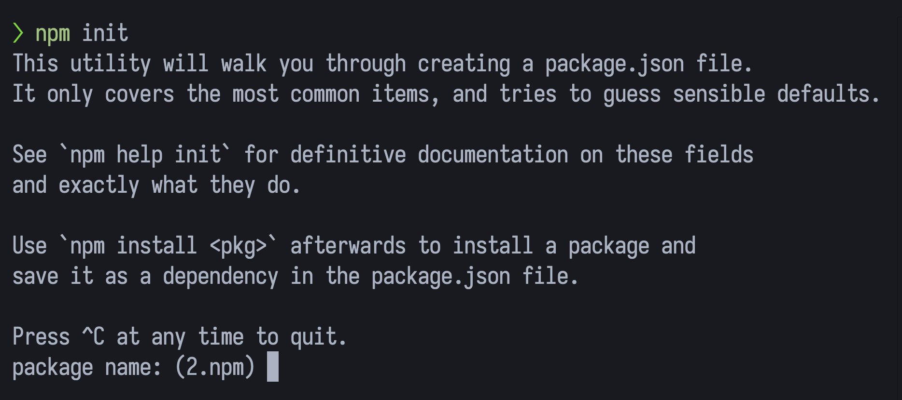
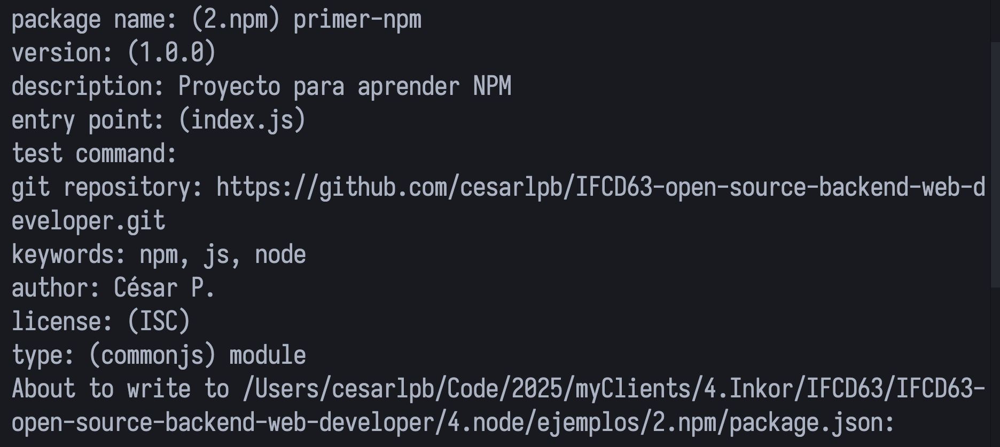
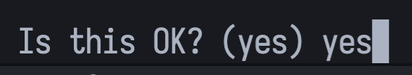

# Pasos para crear proyecto con npm

```bash
  npm init
```



Rellenamos cada apartado:



- **type**: "module" para usar ESModules (`import`)

Aceptamos la confirmación:



Finalmente, en `scripts` añadimos los comandos `start` y `dev` para probar y podremos ejecutar (son equivalentes):

```bash
  node index.js

  npm run start

  npm run dev
```