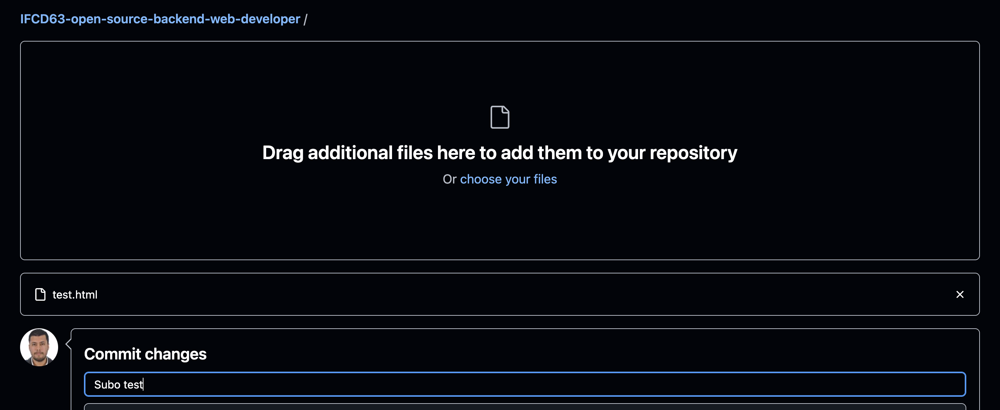
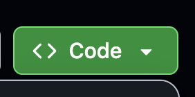
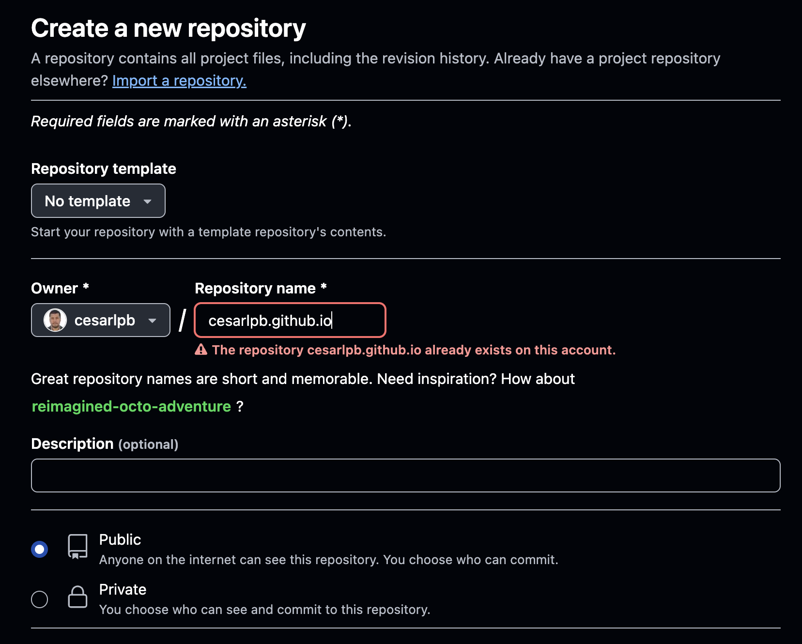

# IFCD63: Open source backend web developer
Repositorio De la formación IFCD63: Open Source Backend Web Developer

# 🚀 Introducción al Desarrollo Web Back End

¡Bienvenido al curso de Open Source Back End Web Developer! Esta guía te ayudará a empezar con tu entorno de desarrollo y a comprender los fundamentos necesarios para tus primeros pasos como desarrollador/a.

---

## 1️⃣ Entender el rol de un desarrollador Backend

Un/a **desarrollador/a backend** es responsable de:
- La lógica del servidor y la base de datos de una aplicación web.
- Crear APIs que conectan el frontend con la base de datos.
- Asegurar la seguridad, escalabilidad y rendimiento de la aplicación.

Tecnologías típicas:
- Lenguajes: Python, PHP, Java, Node.js
- Bases de datos: MySQL, MongoDB, PostgreSQL
- Herramientas: Git, Docker, GitHub, servidores web como Apache o Nginx

---

## 2️⃣ Instalar entorno de desarrollo

### 🔧 Visual Studio Code
- Página oficial: [https://code.visualstudio.com/](https://code.visualstudio.com/)
- Descargar e instalar.

#### Extensiones recomendadas:
- Live Server
- GitLens
- Prettier (formateador de código)
- GitHub Copilot (opcional)

### 🔧 Git
- Página oficial: [https://git-scm.com/](https://git-scm.com/)
- Descargar e instalar.
- En Windows, usa **Git Bash** (se instala junto con Git).

> 💡 **Usuarios Mac:** Git viene preinstalado. Si no está, puedes instalarlo con `brew install git` (requiere Homebrew).

Comprobaciones de Git:

1. Instalamos Git (pasos anteriores)
2. Comprobamos git en terminal con `git --version`
3. Configuramos user y el email con:
```bash
  git config --global user.name "Tu Nombre"
  git config --global user.email "tuemail@ejemplo.com" # cambiar por email de Github
```
4. Colocar VS Code como editor por defecto con `git config --global core.editor "code"`
Comprobamos que es correcto con: `git config core.editor`

> code

---

## 3️⃣ Crear cuenta en GitHub

1. Ve a [https://github.com/](https://github.com/)
2. Crea una cuenta gratuita.
3. Confirma tu email.
4. Personaliza tu perfil con nombre, avatar y bio si quieres.

> 💡 Recomendación: Usa un correo profesional (no de la escuela si es temporal).

---

## 4️⃣ Aprender control de versiones básico

Abre tu terminal (Git Bash en Windows):

```bash
# Configura tu nombre y correo
git config --global user.name "Tu Nombre"
git config --global user.email "tuemail@ejemplo.com"
```

Comandos básicos:

Comando	Descripción
```bash
git --version	Muestra la versión de git
git clone URL	Clona un repositorio desde GitHub
# --------------------------------------------- 
git init	Inicializa un repositorio local
git status	Muestra los cambios actuales
git add .	Añade todos los archivos al staging
git commit -m "Mensaje"	Guarda los cambios en el repositorio local
git remote add origin URL	Conecta tu repo local con GitHub
git push -u origin main	Sube tu código a GitHub

```

--- 

5️⃣ Conocer estructura básica de una página web
```html
<!-- index.html -->
<!DOCTYPE html>
<html lang="es">
<head>
  <meta charset="UTF-8" />
  <title>Mi primera página</title>
</head>
<body>
  <h1>¡Hola, mundo!</h1>
  <p>Esta es mi primera página web.</p>
  
  <p><a href="https://github.com/tuusuario">Mi perfil de GitHub</a></p>
</body>
</html>
```
Guarda este archivo como `index.html` y ábrelo en tu navegador para verlo.

- [Teoría de HTML](https://www.w3schools.com/html/default.asp) 

---

6️⃣ Crear y subir una primera página a GitHub

Paso a paso:

# 1. Crea una carpeta para tu proyecto

- Explorador de archivos:
  - Windows: Abre la carpeta en el explorador de archivos.
  - Mac: Abre la carpeta en Finder.
  - Linux: Abre la carpeta en el explorador de archivos.

- Terminal: 
```bash
mkdir mi-web
cd mi-web
```

# 2. Crea tu archivo HTML
Si no funciona el comando, hacedlo en VS Code.

- En Windows: cread el archivo desde VS Code
- En Mac/Linux: se puede crear desde la terminal con:
```bash
touch index.html  # o créalo con tu editor
```

# 3. Inicializa Git

Cread un repositorio local vacío:

```bash
git init
```

> Por lo general, no hay que colocar un repositorio dentro de otro. (Miramos si hay carpeta `.git` o usamos `git log`)

Debe salir un mensaje de que el repositorio se ha creado en la ruta actual.

> Aparece una carpeta `.git` en la ruta actual. Es una **carpeta oculta** que contiene información sobre el repositorio.

# 4. Añade el archivo

- Podemos hacer esto desde VS Code también con las opciones de control de cambios:


- Desde terminal:

```bash
git add index.html 
git commit -m "Primera versión de mi web"
```

# 5. Crea un repositorio en GitHub (desde la web)

- [Puedes usar este formulario](https://github.com/new)



# 6. Conéctalo con tu repo local

Tomad la referencia al respositorio desde el botón Code en Github:



```bash
git remote add origin https://github.com/cesarlpb/IFCD63-open-source-backend-web-developer.git
```

Este ejemplo usa el enlace de este repositorio de la formación, en vuestro caso si queréis usar uno de vuestros repositorios tenéis que cambiar la URL.

`git clone`

La alternativa a `git init` y usar `git remote add origin` es usar `git clone`:  

```bash
git clone https://github.com/cesarlpb/IFCD63-open-source-backend-web-developer.git
```

> Crea el repositorio local y lo conecta con GitHub.

# 7. Sube tu web

Hay dos opciones para subir tu web:

- Opcional: Publicar en GitHub Pages usando un repositorio de GitHub Pages con el nombre: `<tu_usuario>.github.io` => opción actual
 - Por defecto, la rama que se publica es `main`
- Crear una rama `gh-pages` y subir tu web a esa rama. Como aún no hemos visto ramas, esta opción la dejamos para después.

```
git push -u origin main
```

1. Ir a Github y crear el repositorio de GitHub Pages con el nombre: `<tu_usuario>.github.io`



> En mi caso ya existe este repositorio y no me deja crearlo de nuevo

> La rama por defecto actualmente es `main`, en mi caso es `master`.

[Mi portafolio](https://cesarlpb.github.io/)


**Ejercicio:**

  **Opción 1:**
  - Publicar en GitHub Pages desde el repositorio `<tu_usuario>.github.io`
  **Opción 2:**
  - Ve a la configuración del repo en GitHub.
  - Busca la sección Pages.
  - Selecciona la rama main y carpeta raíz (/).

  - Una vez publicado > subid cambios y comprobad que se actualizan en la URL.

  Tu web estará publicada en `https://<tuusuario>.github.io/` 

## HTML

Contenido de HTML en [html](1.html/)